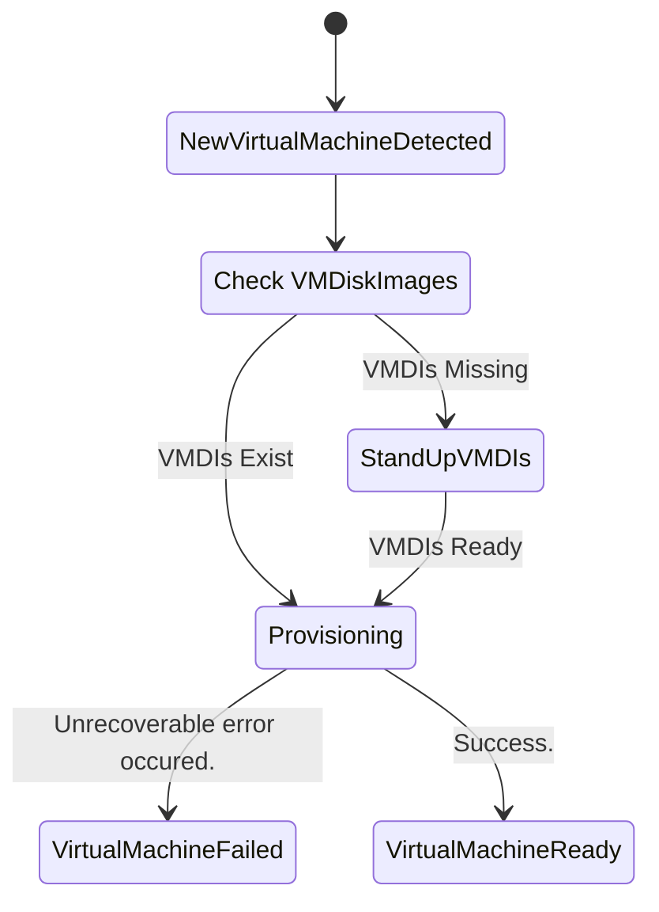
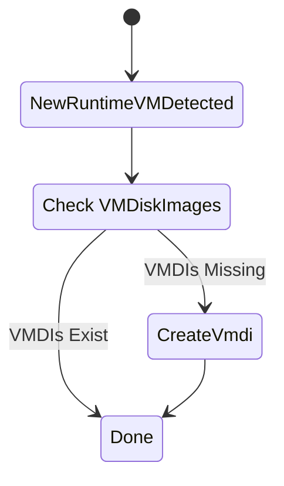

## **Formal Design Proposal**

### **1. Background and Problem Statement**
As Open Terrain (OT) environments grow in use the team has noticed many sharp edges when dealing with VMs that make up workspaces within OT. These sharp edges manifest themselves mainly in the form of a few problems. Those being that Workspaces with VMs can be launched and end up in state where the VM cannot boot as it has attempted startup prior to having the backing data to allow it to spin up.

The second issue revolves around resource pruning. Currently it is very difficult for admins know when they can safely delete the backing data for a VM. Determining if VM backing data is prunable is currently very manual and involves cross referencing cluster state with various outside state stores.

### **1.1 Main pain points**
- **Resource removal**: Currently it is difficult to know when old resources required to back `VirtualMachines` are ready to be removed.
- **No self healing**: The current approach of deploying `VirtualMachines` results in the inability for the platform to attempt to resolve problems without outside interaction.

### **1.2 Current Solution**

Currently manual intervention is required to resolve the issue of a virtual machine starting without backing data. The team must first deploy the backing data required by the VM. This is often enough as the underlying implementation libraries will move the VM to a "Ready" state once the backing data is in place. The team has noticed on occasion that simply putting the required data in place is not enough and the team must "kick" underlying vm resources to "unstick" them.

In regards to resource removal the team must currently cross reference existing backing data with expectations of customers for which workspaces will be launched. If a resources has no more planned usage for the customer it can safely be removed from the cluster.

### **2. Solution 1**
The proposed solution is a new `VirtualMachine` CR and controller along with the expansion of the capabilities of  the `VMDiskImage` controller.

The `VirtualMachine` CR will act as a thin wrapper around what the teams existing VM solution. This will allow OT to have it's own interface to represent a virtual machine decoupling us from direct reference to underlying resources which actually spin up virtual machines in the cluster. This CR paired with the controller will allow the platform to interact with the creation lifecycle of underlying resources as well. We can use this to ensure that we always have the required backing resources for virtual machines allowing the platform to self heal.

To address the second pain point of resource pruning the team can expand the `VMDiskImage` controller to also record the number of referencing `VirtualMachines` on `VMDiskImages`. We can prevent deletion of `VMDiskImages` while they're referencing vms and delete these resources if there are no referencing vms created within a given time period.

### **2.1 VirtualMachine CR**
A `VirtualMachine` can be in the following phases during its lifecycle.

- `Provisioning`: The VirtualMachine is being stood up and any backing data is being created if needed
- `Failed`: Something happened and we cannot recover.
- `Ready`: The virtual machine has been successfully provisioned and is ready for use.

**Example `VirtualMachine` Manifest:**
```
apiVersion: "pelotech.ot/v1alpha1"
kind: "VirtualMachine"
metadata:
  name: "demo-workspace-1"
spec:
    baseVm: ubuntu_2004_lts_en-us_x64
    baseVmVersion: 2.1.2
    ignoreOnDeploy: true
    name: demo-vm
    version: 2.1.0
    users:
      - name: demo user
        plain_text_passwd: demo-pwd
        lock_passwd: false
        sudo: ALL=(ALL) NOPASSWD:ALL
        groups: sudo
    resources:
        cpu: '2'
        memory: 2Gi
        diskSize: 18Gi
    interfaces:
      - network: control-net
        ipAddress: 10.10.0.161/24
      - network: bridge-inet
        ipAddress: 4.29.163.6/28
      - network: bridge-edge
        ipAddress: 172.27.11.11/28
    vmDiskImageRef:
        name: demo-vmdi
        namespace: vmdi-farm
    vmDiskImageTemplate:
        storageClass: "gp3"
        snapshotClass: "ebs-snapshot"
        secretRef: "foo-bar"
        name: "harrison-vm"
        url: "https://s3.us-gov-west-1.amazonaws.com/vm-images/images/harrison-vm/1.0.0/vm.qcow2"
        sourceType: "s3"
        diskSize: "24Gi"
```

#### **2.2: The VirtualMachine Controller**
When a instance of an OT `VirtualMachine` is created the CR's controller will pick up the resource.

The controller will first check if the `VMDiskImage` referenced exists. If it does not exist and a template has been provided for the `VMDiskImage` the controller will create it with the name provided as a reference.

The controller will then create the VM using our standard approach within OT.



### **2.3 Pros and Cons**

#### Pros
- Decoupling OT representation of VM what is actually deployed to make a VM happen. Allows team to have mechanism for handling unexpected behavior that is not yet addressed or won't be addressed by underlying implemetation libraries
- Allows for more robust error handling. Since this CR would own all the implementation resources the operator would have more freedom as far retry strategies it could attempt.
- Slots into existing deployment flows

#### Cons
- A new CR is more to manage and more complexity
- Could be overkill for the above painpoints
- May encourage team to not contribute back to our underlying tooling since the whole purpose is to shim missing behavior.

### **3. Proposed Solution 2**
The proposed solution is a new controller along with the expansion of the capabilities of  the `VMDiskImage` controller.

The team can setup a new controller within the operator to watch "runtime" `datavolumes`. These `datavolumes` are used to clone buildtime `volumesnapshots` that are managed by `VMDIs`. When this controller notices that a runtime `Datavolume` references a `Volumesnapshot` managed by a non-existent `VMDiskImage` it can issue a creation request and derive what the new `VMDiskImage` should look like based on what the runtime `datavolume` is expecting.

To address the second pain point of resource pruning the team can expand the `VMDiskImage` controller to also record the number of referencing runtime `DataVolumes` on `Volumesnapshots` controlled by a given `VMDI`. We can prevent deletion of `VMDiskImages` while they're referencing vms and delete these resources if there are no referencing vms created within a given time period.

### **3.1 Runtime DV Controller**
When a instance of a runtime `datavolume` is created the new controller will pick up the resource. The team can use a label to easily identify and filter on to determine if a `Datavolume` is indeed a runtime `datavolume`.

The controller will first check if the `VMDiskImage` referenced exists. If it does not exist and a template has been provided for the `VMDiskImage` the controller will create it with the name provided as a reference.

The controller will then create the VM using our standard approach within OT.



### **3.3 Pros and Cons**

#### Pros
- Does not require any alteration of existing customer deployment flows.
- Does not require new CR and adds no new abstractions

#### Cons
- Potentially less flexibility for error handling.

### **4: Considered alternatives**

The following alternatives have been considered

#### Declare these pain points out of scope of the platform itself

Leave it to the customer to handle these issues. It may not necessarily be the responsibility of OT to handle these things.

### **5: What this doesn't fix**

There remains the open issue of handling workspace cleanup on the platform when encountering an error. A failed VM Provisioning is one such case. The team is currently working on a solution for this issue but it is out of scope of this proposal.

### **6: Discussion**

The team would like to explore whether the introduction of a custom "VM" CR is worthwhile. The team does acknowledge the need for us to check if something is requesting a build resource that has not been cached.

The team would like to explore if we can get enough control by checking for runtime Datavolumes which reference a volumesnapshot controlled by buildtime VMDIs. If creation of the referenced volumesnapshot is enough to get the VM out of it's loop then we should be good to go. If it is not enough the team will need to re-evaluate.

Watching runtime Datavolumes does give us the information to  do some kind of reference counting/caching on data volumes. The team could devise a clean up strategy for VMDIs this way.
Both of these solutions when put together would allow to team to implement robust self healing for OT VMs within a workspace and aide in visibility of VMDI usage.


### **7: Decision**

TODO
