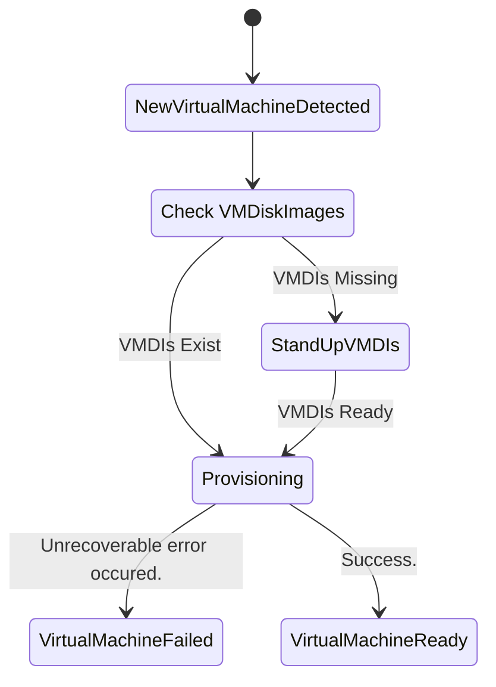

## **Formal Design Proposal: VirtualMachine CRD**

This document proposes the creation of a `VirtualMachine` Custom Resource (CR) and a corresponding Kubernetes Controller. A `VirtualMachine` represents single VM within OT and is responsible for all of the underlying child resources required to allow the VM to be used within Open Terrain (OT) workspaces. A workspace in OT can consist of one or more VMs and containers all networked together.

This proposed solution is intended to move the complexity of managing VMs in OT from customers to the platform. This solution will allow users to worry less about the implementation details of deploying a VM to OT and will reduce admins/engineer toil as addressing things like missing VM resources and resource pruning which are handled manually at this time.

### 2. Background and Problem Statement
As Open Terrain (OT) environments grow in use the team has noticed many sharp edges when dealing with VMs that make up workspaces within OT. These sharp edges manifest themselves mainly in the form of a few problems. Those being that Workspaces with VMs can be launched and end up in state where the VM cannot boot as it has attempted startup prior to having the backing data to allow it to spin up.

The second issue revolves around resource pruning. Currently it is very difficult for admins know when they can safely delete the backing data for a VM. Determining if VM backing data is prunable is currently very manual and involves cross referencing cluster state with various outside state stores.

### 2.1 Main pain points
- **Resource removal**: Currently it is difficult to know when old resources required to back `VirtualMachines` are ready to be removed.
- **No self healing**: The current approach of deploying `VirtualMachines` results in the inability for the platform to attempt to resolve problems without outside interaction.

### **3. Proposed Solution**
The proposed solution is a new `VirtualMachine` CR and controller along with the expansion of the capabilities of  the `VMDiskImage` controller.

The `VirtualMachine` CR will act as a thin wrapper around what the teams existing VM solution. This will allow OT to have it's own interface to represent a virtual machine decoupling us from direct reference to underlying resources which actually spin up virtual machines in the cluster. This CR paired with the controller will allow the platform to interact with the creation lifecycle of underlying resources as well. We can use this to ensure that we always have the required backing resources for virtual machines allowing the platform to self heal.

To address the second pain point of resource pruning the team can expand the `VMDiskImage` controller to also record the number of referencing `VirtualMachines` on `VMDiskImages`. We can prevent deletion of `VMDiskImages` while they're referencing vms and delete these resources if there are no referencing vms created within a given time period.

### **3.1 VirtualMachine CR**
A `VirtualMachine` can be in the following phases during its lifecycle.

- `Provisioning`: The VirtualMachine is being stood up and any backing data is being created if needed
- `Failed`: Something happened and we cannot recover.
- `Ready`: The virtual machine has been successfully provisioned and is ready for use.

**Example `VirtualMachine` Manifest:**
```
apiVersion: "pelotech.ot/v1alpha1"
kind: "VirtualMachine"
metadata:
  name: "demo-workspace-1"
spec:
    baseVm: ubuntu_2004_lts_en-us_x64
    baseVmVersion: 2.1.2
    ignoreOnDeploy: true
    name: demo-vm
    version: 2.1.0
    users:
      - name: demo user
        plain_text_passwd: demo-pwd
        lock_passwd: false
        sudo: ALL=(ALL) NOPASSWD:ALL
        groups: sudo
    resources:
        cpu: '2'
        memory: 2Gi
        diskSize: 18Gi
    interfaces:
      - network: control-net
        ipAddress: 10.10.0.161/24
      - network: bridge-inet
        ipAddress: 4.29.163.6/28
      - network: bridge-edge
        ipAddress: 172.27.11.11/28
    vmDiskImageRef:
        name: demo-vmdi
        namespace: vmdi-farm
    vmDiskImageTemplate:
        storageClass: "gp3"
        snapshotClass: "ebs-snapshot"
        secretRef: "foo-bar"
        name: "harrison-vm"
        url: "https://s3.us-gov-west-1.amazonaws.com/vm-images/images/harrison-vm/1.0.0/vm.qcow2"
        sourceType: "s3"
        diskSize: "24Gi"
```

#### **3.2: The VirtualMachine Controller**
When a instance of an OT `VirtualMachine` is created the CR's controller will pick up the resource.

The controller will first check if the `VMDiskImage` referenced exists. If it does not exist and a template has been provided for the `VMDiskImage` the controller will create it with the name provided as a reference.

The controller will then create the VM using our standard approach within OT.


### **4: Considered alternatives**

The following alternatives have been considered

#### Track underlying VM implementation resources

We could directly track the underlying resource which represents a VM which is a kubevirt VM CR. This would allow us to not introduce a new custom resource and a layer of indirection. The determining factor in not taking this approach is the added value in decoupling the OT representation of VM from what is used to implement them. The chosen approach allows the team to change underlying implementation details without having to alter the interface.

#### Usage of outside service to Record VMDI usage in workspaces

This option would circumvent the need for the new CRD and Controller. However, it would result in the duplication of state. OT should be the ultimate source of truth when it comes to resource ownership and this introduction of an outside service may result in more indirection and issues with state inconsistency.


### **5: What this doesn't fix**

There remains the open issue of handling workspace cleanup on the platform when encountering an error. A failed VM Provisioning is one such case. The team is currently working on a solution for this issue but it is out of scope of this proposal.
