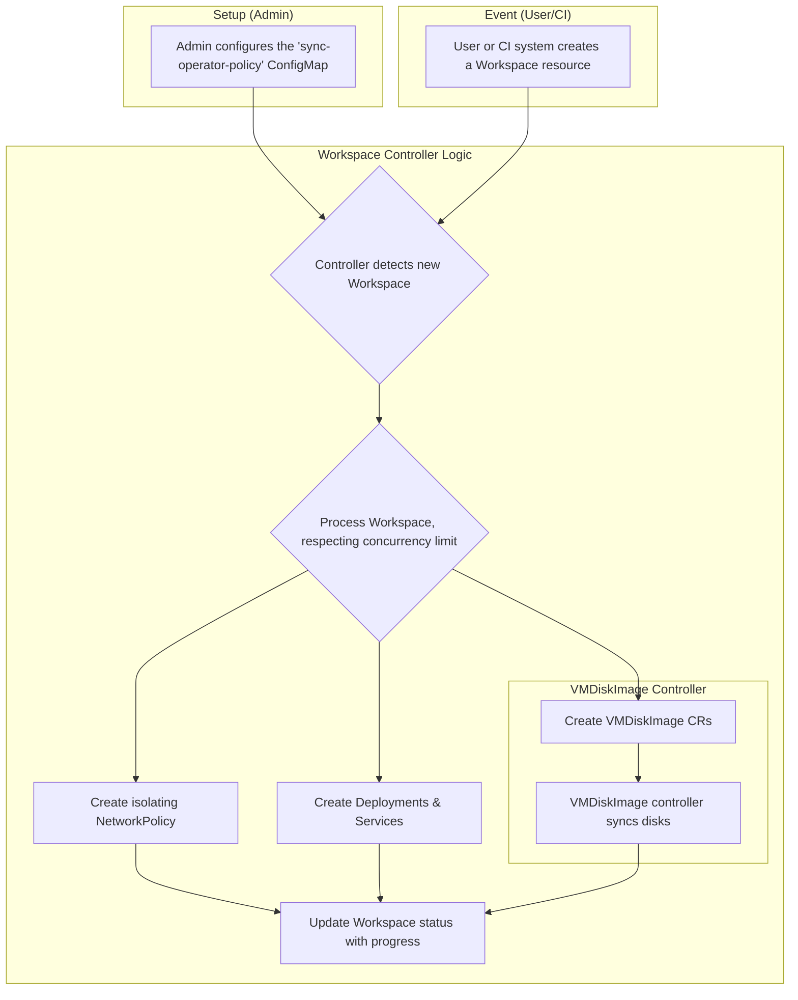

## **Formal Design Proposal: Workspace CRD**

This document proposes the creation of a `Workspace` Custom Resource Definition (CRD) and a corresponding Kubernetes Controller. A Workspace represents a grouping of one or more virtual machines (VMs) and/or containers that communicate with each other in an isolated network within the cluster.

The proposed system will provide a unified, declarative API for deploying complex, multi-component environments. This simplifies the management of applications that require both traditional VMs and modern containerized services. The Workspace controller will orchestrate the creation, networking, and lifecycle of all associated resources, ensuring they are deployed cohesively.

### 2. Background and Problem Statement
As Open Terrain (OT) environments grow in complexity, there is an increasing need to deploy applications composed of multiple, interconnected components. These "workspaces" often consist of several VMs and containers that need to function as a single logical unit. The current approach to deploying these workspaces requires more knowledge of the guts of workspaces than required for users of the platform.

### 2.1 Main pain points
- **Resource removal**: Currently it is difficult to know when old resources required to back `Workspaces` are ready to be removed. Removal of these resources could be tied to Workspace Lifecycles.
- **No self healing**: The current approach of deploying Workspaces all at once via a helm chart results in the inability for the platform to attempt to resolve problems without outside interaction.
- **No Unified Status**: It is difficult to determine the overall health and status of a workspace. An admin must manually inspect each individual component to diagnose issues.

### **3. Proposed Architecture**
The proposed solution is a new `Workspace` CRD and controller that builds upon the existing `VMDiskImage` controller's patterns. It introduces a high-level abstraction for an entire environment.

The `Workspace` CRD will serve as a blueprint for a complete, isolated environment. It will define all the necessary VMs, containers, and networking rules. The workspace CRD will be a cluster scoped resource.

### **3.1 Workspace Lifecycle**
The `Workspace` can be in the following phases during its lifecycle.

- `Provisioning`: The Workspace has being stood up
- `Failed`: Something happened and we cannot recover the workspace.
- `Ready`: The workspace has been successfully provisioned and is ready for use.

The `Workspace` can have the following conditions.

- `CreatingWorks`

**Example `Workspace` Manifest:**
```yaml
apiVersion: "pelotech.ot/v1alpha1"
kind: "Workspace"
metadata:
  name: "data-analysis-environment-1"
spec:
  # Defines the VMs to be included in the workspace.
  # The controller will create a VMDiskImage resource for each entry.
  virtualMachines:
    - name: "database-vm"
      spec:
        VMDiskImageName: "database-vmdi"
    - name: "analytics-vm"
      spec:
        VMDiskImageName: "analytics-vmdi"

  # Defines the containers to be included in the workspace.
  # The controller will create a Deployment for each entry.
  containers:
    - name: "api-server"
      image: "my-registry/api-server:3.1.0"
      ports:
        - containerPort: 8080
          protocol: TCP

  # Defines networking policy for the workspace.
  network:
    # If true, the controller creates a NetworkPolicy to isolate all
    # components in this workspace from other workloads in the namespace.

# The operator manages this section to provide real-time status.
status:
  phase: "Provisioning"
  message: "Creating resources for workspace."
  conditions:
    - type: "Ready"
      status: "False"
      lastTransitionTime: "2025-07-12T10:30:00Z"
  # Status of individual components for easy diagnosis.
  resourceStatus:
    virtualMachines:
      - name: "database-vm"
        phase: "Succeeded"
      - name: "analytics-vm"
        phase: "Queued"
    containers:
      - name: "api-server"
        status: "Pending"
```

#### **3.3: The Workspace Controller**
The Workspace Controller will orchestrate the creation and management of all resources defined in a `Workspace` manifest.

**Operator Logic:**
- **Watch for Workspaces**: The operator watches for new `Workspace` resources.
- **Enforce Concurrency**: It adheres to the `workspaceConcurrency` limit defined in the `ConfigMap`.
- **Resource Orchestration**: For each `Workspace` resource, the controller will:
    1. Create a `VMDiskImage` resource for each entry in the `spec.virtualMachines` list.
    2. Create a `Deployment` and `Service` for each entry in the `spec.containers` list.
    3. If `spec.network.isolate` is `true`, create a `NetworkPolicy` that allows traffic only between the pods and VMs belonging to this workspace.
- **Update Status**: The controller provides real-time feedback by updating the `status` field of the `Workspace` resource, aggregating the status of all child resources.

### **4. End-to-End Controller Workflow**


### **5. Future Considerations (Non-MVP)**
- **Inter-Workspace Communication**: Develop a mechanism to define explicit rules for allowing traffic between specific workspaces.
- **Advanced Networking**: Support for more complex network topologies, such as defining specific `Egress` or `Ingress` rules to external services.
- **Templating**: Introduce a templating mechanism to allow for reusable workspace definitions.
