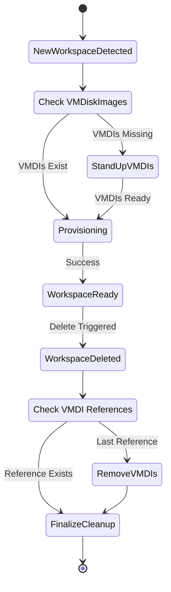

## **Formal Design Proposal: Workspace CRD**

This document proposes the creation of a `Workspace` Custom Resource Definition (CRD) and a corresponding Kubernetes Controller. A Workspace represents a grouping of one or more virtual machines (VMs) and/or containers that communicate with each other in an isolated network within the cluster.

The proposed system will provide a unified, declarative API for deploying complex, multi-component environments. This simplifies the management of applications that require both traditional VMs and modern containerized services. The Workspace controller will orchestrate the creation, networking, and lifecycle of all associated resources, ensuring they are deployed cohesively.

### 2. Background and Problem Statement
As Open Terrain (OT) environments grow in complexity, there is an increasing need to deploy applications composed of multiple, interconnected components. These "workspaces" often consist of several VMs and containers that need to function as a single logical unit. The current approach to deploying these workspaces requires more knowledge of the guts of workspaces than required for users of the platform.

### 2.1 Main pain points
- **Resource removal**: Currently it is difficult to know when old resources required to back `Workspaces` are ready to be removed. Removal of these resources could be tied to Workspace Lifecycles.
- **No self healing**: The current approach of deploying Workspaces all at once via a helm chart results in the inability for the platform to attempt to resolve problems without outside interaction.
- **No Unified Status**: It is difficult to determine the overall health and status of a workspace. An admin must manually inspect each individual component to diagnose issues.

### **3. Proposed Architecture**
The proposed solution is a new `Workspace` CRD and controller that builds upon the existing `VMDiskImage` controller's patterns.

The `Workspace` CRD will serve as a blueprint for a complete, isolated environment. It will define all the necessary VMs, containers, and networking rules. The introduction of this cluster scoped resource will allow the platform team to have a single interface for OT customers to deploy workspaces to the system.

### **3.1 Workspace Lifecycle**
The `Workspace` can be in the following phases during its lifecycle.

- `Provisioning`: The Workspace is being stood up.
- `Failed`: Something happened and we cannot recover the workspace.
- `Ready`: The workspace has been successfully provisioned and is ready for use.

When a workspace is first recognized by the Cluster it will be placed in a `Provisioning` state. While provisioning the cluster will check to see if any VMDIs required do not yet exist. Should the VMDIs not exist the controller will create them and wait on standing up the rest of the workspace until the VMDIs are ready.

Once the VMDIs are ready the controller will preform the operations to stand up workspaces by creating any underlying resources. Should this step fail the workspace will be moved into a `Failed` state. When the workspace is successfully created and all sub components are reading green it will be moved into a `Ready` state.

**Example `Workspace` Manifest:**
```yaml
apiVersion: "pelotech.ot/v1alpha1"
kind: "Workspace"
metadata:
  name: "demo-workspace-1"
spec:
    vms:
      - baseVm: ubuntu_2004_lts_en-us_x64
        baseVmVersion: 2.1.2
        ignoreOnDeploy: true
        name: demo-vm
        version: 2.1.0
        backingVMDiskImage: demo-vmdi
        resources:
          cpu: '2'
          memory: 2Gi
        diskSize: 18Gi
        interfaces:
          - network: control-net
            ipAddress: 10.10.0.161/24
          - network: bridge-inet
            ipAddress: 4.29.163.6/28
          - network: bridge-edge
            ipAddress: 172.27.11.11/28
        ansible:
          roles:
            build:
              - role: specialize
              - role: linuxRouter
                variables:
                  enable_nat: true
                  nat_out_iface_idx: 1
            deploy:
              - role: runtimeChecks
    containerClusters:
      - ignoreOnDeploy: false
        name: demo-app
        interfaces:
          - network: bridge-inet
            ipAddress: 4.29.163.7/28
        containers:
          - name: chef
            image: 'ghcr.io/demo/demo-containers/demo-app:1.0.2'
            resources:
              cpu: 128m
              memory: 256Mi
            capabilities:
              drop:
                - ALL
              add:
                - NET_BIND_SERVICE
            volumeMounts:
              - name: dnsconfig
                containerPath: /config
                readOnly: true
            portMappings:
              - containerPort: 53
                protocol: udp
                hostPort: 53
      - ignoreOnDeploy: false
        name: ansible
        interfaces:
          - network: control-net
            ipAddress: 10.10.0.141/24
        containers:
          - name: ansible
            image: 'ghcr.io/demo/demo-containers/ansible:2.5.14'
            resources:
              cpu: 384m
              memory: 2048Mi
            env:
              - name: DEBUG
                value: 'true'
    volumes:
      - name: monitorconfigs
        size: 1Gi
        localPath: /config
      - name: dnsconfig
        size: 1Gi
        localPath: /demo-app-config
    networks:
      - name: control-net
        cidr: 10.10.0.0/24
      - name: capture-net
        cidr: 10.10.1.0/24
      - name: bridge-inet
        cidr: 4.29.163.0/28
        nameservers:
          addresses:
            - 4.29.163.7
        rangeGateway: 4.29.163.14
        routes:
          - destinationNetworkCidr: 0.0.0.0/0
            nextHopIpAddress: 4.29.163.14
      - name: bridge-edge
        cidr: 172.27.11.0/28
        routes:
          - destinationNetworkCidr: 0.0.0.0/0
            nextHopIpAddress: 172.27.11.11
          - destinationNetworkCidr: 172.26.0.0/15
            nextHopIpAddress: 172.27.11.12
        nameservers:
          addresses:
            - 4.29.163.7
      - name: edge-fw
        cidr: 172.26.5.0/28
        routes:
          - destinationNetworkCidr: 0.0.0.0/0
            nextHopIpAddress: 172.26.5.11
          - destinationNetworkCidr: 172.26.0.0/16
            nextHopIpAddress: 172.26.5.12
        nameservers:
          addresses:
            - 4.29.163.7
      - name: range-services
        cidr: 172.26.1.0/24
        routes:
          - destinationNetworkCidr: 0.0.0.0/0
            nextHopIpAddress: 172.26.1.254
        nameservers:
          addresses:
            - 172.26.1.101
```
#### **3.2: The Workspace Controller**
The Workspace Controller will orchestrate the creation and management of all resources defined in a `Workspace` manifest. Below is
the high flow of a Workspace through the controller


### **4: Considered alternatives**

The following alternatives have been considered

#### Deploying VMDiskImages prior to Workspace creation

This option seems viable on the face however it does not resolve the issue where a OT user attempts to stand up a workspace while a VMDiskImage is syncing. This would still result in a workspace getting stuck and requiring outside intervention.

#### Usage of outside service to Record VMDI usage in workspaces

This option would circumvent the need for the new CRD and Controller however would result in the duplication of state. OT should be the ultimate sources of truth when it comes to resource ownership and this introduction of an outside service may result in more indirection and issues with state incosistency.
